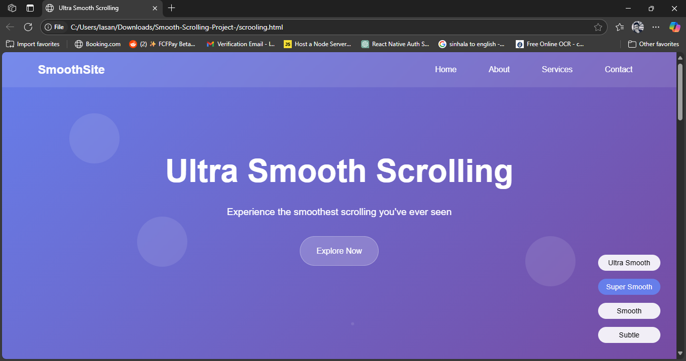

# Smooth Scrolling Project

A smooth scrolling website with 60fps performance and beautiful animations.

## Features

- smooth scrolling with customizable speed
- Mobile-friendly touch support
- Parallax effects
- Glassmorphism design
- Responsive layout

## Demo



## Quick Start

1. Clone the repo:
   ```bash
   git clone https://github.com/lasantha746/Smooth-Scrolling-Project-.git
   ```

2. Open `index.html` in your browser

## How to Use

- Scroll to see the smooth effect
- Use controls on the right to adjust smoothness
- Works on desktop and mobile

## Customization

Change smoothness in the JavaScript:
```javascript
this.ease = 0.1; // 0.05 = ultra smooth, 0.2 = subtle
```

## Browser Support

Works on all modern browsers (Chrome, Firefox, Safari, Edge)

## License

MIT License
